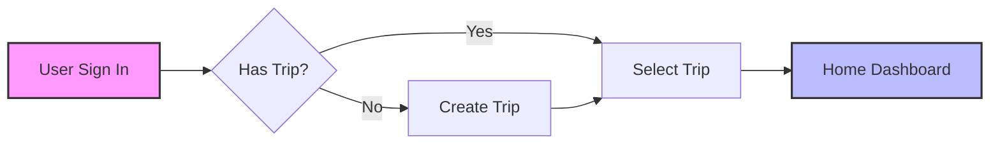
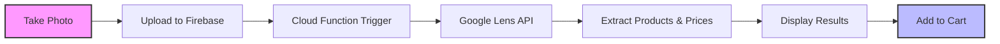

# SkyPocket

  


<div align="center">

  <br />
  <br />
  <p>
    <b>Your Intelligent Travel Companion for Shopping & Budgeting Abroad</b>
  </p>
</div>

---

SkyPocket is a comprehensive travel companion application designed to streamline trip management, expense tracking, and shopping while abroad. It combines a modern React Native frontend with a robust Firebase backend to provide real-time currency conversion, smart product detection, and budget management.

## Project Structure

The project is divided into two main directories:

-   **frontend/**: Contains the mobile application built with Expo and React Native.
-   **backend/**: Contains the server-less backend logic using Firebase Cloud Functions.

## Features

-   **Trip Management**: Create, organize, and switch between multiple trips with specific destinations.
-   **Smart Expense Tracking**: Log expenses and monitor them against your set budget.
-   **Currency Conversion**: Real-time conversion between your home currency and the local currency of your destination.
-   **Visual Product Search**: Upload photos of items to automatically detect products, compare prices, and find similar items using Google Lens integration.
-   **Shopping Cart**: Manage a list of intended purchases and track their costs.
-   **Finance Dashboard**: Visualize spending habits and budget allocation.
-   **Secure Authentication**: User sign-up and sign-in functionality powered by Firebase Auth.

## Tech Stack

### Frontend


-   **Framework**: React Native with Expo SDK 52
-   **Language**: TypeScript
-   **Styling**: NativeWind (Tailwind CSS for React Native)
-   **Navigation**: Expo Router
-   **Icons**: Lucide React Native
-   **State/Data**: Firebase Client SDK (Auth, Firestore, Storage)

### Backend

<!--  -->


-   **Runtime**: Node.js 22 (Firebase Cloud Functions)
-   **Language**: TypeScript
-   **Integrations**:
    -   Google Cloud Vision / SerpApi (for image analysis and product search)
    -   Currency.js (for financial calculations)
    -   Cheerio (for data parsing)
    -   Exchange API for (for real-time currency conversion rates)
    -   sales-tax (for real-time tax rates)

## Workflows

### 1. Trip Initialization

Seamlessly start your journey by creating or selecting a trip.



### 2. Smart Product Discovery

Snap a photo of an item to instantly find details and pricing.



## Getting Started

### Prerequisites

-   Node.js (v22 recommended)
-   pnpm or npm
-   Expo CLI
-   Firebase CLI

### Installation

1.  **Clone the repository**

2.  **Frontend Setup**
    Navigate to the frontend directory and install dependencies:

    ```bash
    cd frontend
    pnpm install
    ```

3.  **Backend Setup**
    Navigate to the backend functions directory and install dependencies:
    ```bash
    cd backend/functions
    npm install
    ```

### Running the Application

1.  **Start the Backend (Emulators)**
    From the `backend/functions` directory:

    ```bash
    npm run emulate
    ```

2.  **Start the Frontend**
    From the `frontend` directory:
    ```bash
    npx expo start
    ```
    Use the Expo Go app on your physical device or an Android/iOS emulator to run the application.

## Configuration

-   **Firebase**: Ensure you have the `google-services.json` (Android) and `GoogleService-Info.plist` (iOS) placed in the appropriate directories within `frontend/` if you are building native binaries, or configure the web credentials in your environment files.
-   **Environment Variables**: Check for `.env` files or Expo config for API keys (e.g., SerpApi, Firebase config).

## License

All rights reserved. This project is proprietary and may not be used, copied, modified, or distributed without explicit permission from the author.
